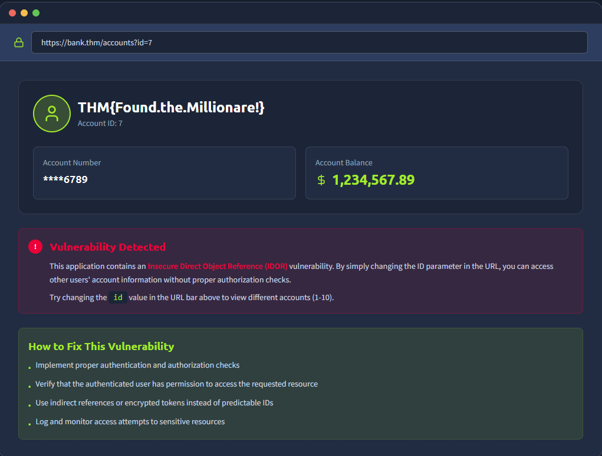

# Broken Access Control (IDOR) Assessment – Account Management System

## Overview

This project documents a hands-on security assessment conducted as part of the TryHackMe OWASP Top 10 (2025) learning path, specifically within **A01: Broken Access Control (IAAA Failures)**.

The objective of this exercise was to identify and analyze an **Insecure Direct Object Reference (IDOR)** vulnerability that allowed unauthorized access to sensitive account information by manipulating user-controlled parameters in the URL.

---

## Learning Objectives

* Understand the concept of Broken Access Control and IDOR vulnerabilities.
* Identify insecure authorization mechanisms in web applications.
* Assess the potential business impact of unauthorized data access.
* Learn recommended mitigation strategies for access control weaknesses.
* Practice documenting security findings in a professional format.

---

## Scenario

A simulated online banking application allows users to view account information through a URL parameter:

```http
https://bank.thm/accounts?id=1
```

During testing, it was observed that changing the value of the **id** parameter directly in the URL allowed access to other users' account information without additional authorization checks.

The application failed to verify whether the authenticated user was permitted to access the requested account resource.

---

## Methodology

### 1. Reconnaissance

* Reviewed application functionality.
* Identified account details accessible through a URL parameter.
* Observed that account records were referenced using predictable numerical identifiers.

### 2. Analysis

* Examined how the application handled requests for different account IDs.
* Investigated whether authorization checks were performed before displaying account data.

### 3. Validation

* Modified the `id` parameter within the URL.
* Confirmed that multiple account records could be accessed by changing the identifier.
* Verified that sensitive account information was disclosed without proper access validation.

### 4. Documentation

* Recorded observations and screenshots.
* Assessed potential security and business risks.
* Documented remediation recommendations.

---

## Findings

### Finding 1: Insecure Direct Object Reference (IDOR)

**Category:** OWASP Top 10 (2025) – A01: Broken Access Control

The application exposed internal account objects through a user-controlled parameter.

Users could manipulate the following request:

```http
https://bank.thm/accounts?id=7
```

By changing the account identifier value, additional account records became accessible without authorization verification.

This behavior indicates the presence of an **Insecure Direct Object Reference (IDOR)** vulnerability.

---

## Impact

If exploited in a real-world environment, this vulnerability could lead to:

* Unauthorized access to sensitive customer information.
* Exposure of financial records.
* Privacy and confidentiality breaches.
* Regulatory compliance violations.
* Increased risk of fraud and account enumeration.
* Reputational damage to the organization.

**Risk Severity:** High

---

## Evidence

### Observation

The application successfully displayed account information after modifying the account identifier parameter.

Example:

```http
/accounts?id=1
/accounts?id=2
/accounts?id=3
```

Each request returned data belonging to a different account holder without verifying ownership.

### Screenshot Evidence



### Security Observation

The application relied solely on the client-supplied object identifier and did not enforce server-side authorization controls.

---

## Remediation

### 1. Implement Server-Side Authorization Checks

Validate that the authenticated user is authorized to access the requested resource before returning any data.

### 2. Enforce Ownership Verification

Ensure users can only access records associated with their own account.

Example:

```text
User A → Account A
User B → Account B
```

Access attempts outside the user's authorized scope should be denied.

### 3. Use Indirect References

Replace predictable identifiers with:

* UUIDs
* Randomized tokens
* Reference mapping systems

Example:

```text
8c7f0f96-d4e1-4cb9-8d9f-xxxxxxxxxxxx
```

### 4. Implement Access Logging and Monitoring

Record all access attempts to sensitive resources and generate alerts for suspicious activity.

### 5. Conduct Regular Authorization Testing

Perform periodic access control reviews and penetration testing to identify privilege escalation or object reference weaknesses.

---

## Skills Demonstrated

* Broken Access Control Assessment
* IDOR Identification
* Vulnerability Validation
* Risk Analysis
* Security Documentation
* Security Reporting
* Web Application Security Testing
* OWASP Top 10 Mapping

---

## Tools Used

* Web Browser
* Browser Developer Tools
* URL Parameter Manipulation
* TryHackMe Lab Environment

---

## Key Takeaways

* Access control vulnerabilities are among the most critical web application security risks.
* Client-supplied identifiers should never be trusted as the sole mechanism for authorization decisions.
* Proper authorization must always be enforced on the server side.
* Even simple parameter manipulation can lead to significant data exposure if access controls are not correctly implemented.
* Broken Access Control remains one of the most common and impactful vulnerabilities identified in modern web applications.

---

## OWASP Mapping

| Category                | Classification                          |
| ----------------------- | --------------------------------------- |
| OWASP Top 10 (2025)     | A01: Broken Access Control              |
| Vulnerability Type      | Insecure Direct Object Reference (IDOR) |
| Risk Level              | High                                    |
| Impact                  | Unauthorized Data Access                |
| Attack Complexity       | Low                                     |
| Authentication Required | Yes (Typical Scenario)                  |

---

## Disclaimer

This project was completed in a controlled educational environment provided by TryHackMe for learning and cybersecurity training purposes. No real systems or sensitive data were accessed during this exercise.
