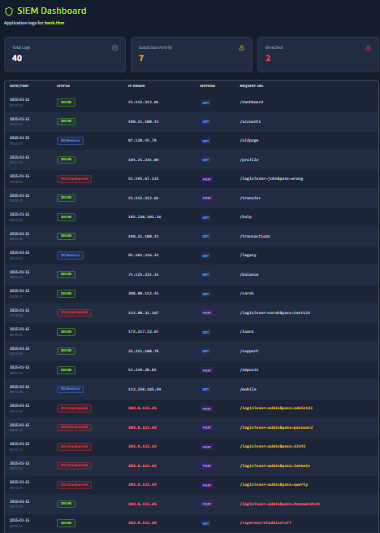
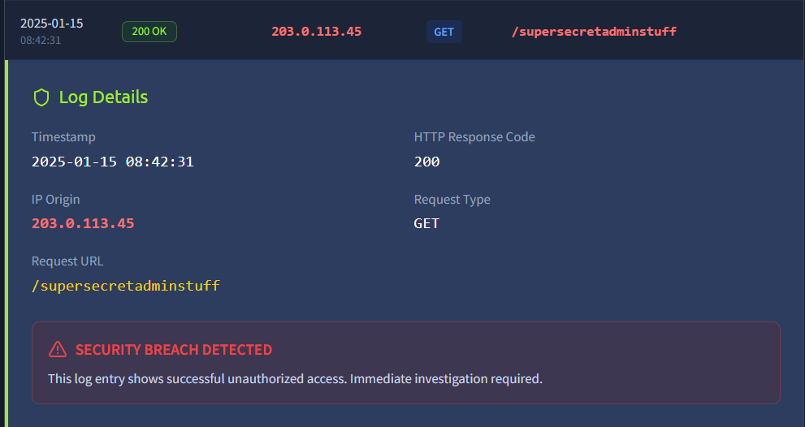

# Logging & Alerting Failures Assessment – Unauthorized Administrative Resource Access

## Overview

This project documents a hands-on security assessment conducted as part of the TryHackMe OWASP Top 10 (2025) learning path, specifically within **A09: Logging & Alerting Failures (IAAA Failures)**.

The objective of this exercise was to analyze application logs, identify indicators of suspicious activity, and understand how insufficient logging and alerting mechanisms can delay the detection and response to security incidents.

---

## Learning Objectives

* Understand the importance of logging and monitoring in security operations.
* Identify suspicious activities through application log analysis.
* Recognize indicators of unauthorized access attempts.
* Assess the security impact of inadequate alerting mechanisms.
* Practice documenting security findings and incident indicators.

---

## Scenario

A web-based banking application maintains activity logs for user requests and transactions.

During analysis of the application's SIEM dashboard, several suspicious requests were identified, including access attempts to sensitive administrative resources and repeated authentication-related requests.

One particular log entry revealed successful access to an administrative endpoint that should not be publicly accessible:

```http id="u6g5d2"
GET /supersecretadminstuff
```

The request returned a successful HTTP response:

```text id="j3m9f8"
HTTP Status: 200 OK
```

This activity suggests that an attacker successfully accessed a restricted resource and highlights the importance of timely detection, monitoring, and alerting.

---

## Methodology

### 1. Reconnaissance

* Reviewed the SIEM dashboard and available application logs.
* Identified indicators of suspicious activity.
* Examined request patterns and response codes.

### 2. Analysis

* Investigated requests targeting sensitive resources.
* Analyzed source IP addresses and request methods.
* Evaluated response codes for evidence of successful access.

### 3. Validation

* Confirmed that a sensitive administrative endpoint returned a successful response.
* Verified that the request was classified as suspicious activity.
* Reviewed additional log entries indicating potential credential attacks and unauthorized access attempts.

### 4. Documentation

* Recorded relevant log entries.
* Assessed potential security impact.
* Documented recommendations for improving logging and alerting capabilities.

---

## Findings

### Finding 1: Successful Access to Sensitive Administrative Resource

**Category:** OWASP Top 10 (2025) – A09: Logging & Alerting Failures

Log analysis identified a request to a sensitive administrative endpoint:

```http id="g7v2q1"
/supersecretadminstuff
```

The request originated from:

```text id="s8k1p4"
203.0.113.45
```

The application returned:

```text id="n5d7w3"
HTTP 200 OK
```

This indicates that access to a potentially restricted resource was successfully granted.

If logging and monitoring controls were absent or ineffective, this activity could remain undetected, allowing attackers to maintain unauthorized access without triggering security investigations.

---

## Impact

If similar events occur in a production environment without adequate monitoring and alerting, the consequences may include:

* Unauthorized access to administrative resources.
* Exposure of sensitive business data.
* Delayed incident detection and response.
* Increased attacker dwell time within the environment.
* Regulatory compliance violations.
* Financial and reputational damage.

**Risk Severity:** Medium to High

---

## Evidence

### Observation 1 – Suspicious Administrative Request

The SIEM dashboard recorded successful access to a sensitive endpoint:

```http id="z2v4n8"
GET /supersecretadminstuff
```

Response:

```text id="x7w5m2"
200 OK
```

### Observation 2 – Security Alert Triggered

The log detail page generated a security warning indicating suspicious activity.

Observed indicators:

* Access to sensitive resource.
* Successful HTTP response.
* Unusual request path.
* Security breach notification.

### Observation 3 – Additional Suspicious Activity

The dashboard also displayed multiple suspicious authentication-related requests, including:

```text id="c6j8f1"
/login?user=admin&pass=...
```

These requests may indicate:

* Credential stuffing attempts.
* Password guessing attacks.
* Authentication abuse.

### Screenshot Evidence

#### SIEM Dashboard Overview



---

#### Log Investigation Details



### Security Observation

The event demonstrates how logging and monitoring systems play a critical role in detecting suspicious activity and supporting incident response investigations.

Without effective alerting mechanisms, attackers may successfully access sensitive resources without generating actionable security notifications.

---

## Remediation

### 1. Centralize Security Logging

Collect logs from:

* Web servers
* Application servers
* Authentication services
* Network devices

into a centralized logging platform.

---

### 2. Implement Real-Time Alerting

Generate alerts for:

* Administrative endpoint access
* Authentication failures
* Privilege escalation events
* Unusual user behavior

---

### 3. Define Security Monitoring Use Cases

Create detection rules for:

```text id="e4r9k7"
Unauthorized admin access
Multiple failed logins
Sensitive URL access
Privilege abuse
```

---

### 4. Retain Security Logs

Maintain logs according to organizational and regulatory requirements to support forensic investigations.

---

### 5. Conduct Continuous Log Review

Perform routine monitoring and threat hunting activities to identify anomalies before they become security incidents.

---

## Skills Demonstrated

* Log Analysis
* Security Monitoring
* Threat Detection
* Security Event Investigation
* SIEM Analysis
* Incident Identification
* Risk Assessment
* Security Documentation
* Security Reporting
* OWASP Top 10 Mapping

---

## Tools Used

* SIEM Dashboard
* Web Browser
* Log Analysis Interface
* TryHackMe Lab Environment

---

## Key Takeaways

* Logging is essential for detecting suspicious and malicious activity.
* Security events that are not monitored cannot be effectively investigated.
* Real-time alerting significantly reduces incident response time.
* Sensitive administrative resources should be closely monitored and protected.
* Effective logging and alerting controls are critical components of modern security operations.
* Security monitoring provides visibility that enables organizations to identify threats before significant damage occurs.

---

## OWASP Mapping

| Category             | Classification                              |
| -------------------- | ------------------------------------------- |
| OWASP Top 10 (2025)  | A09: Logging & Alerting Failures            |
| Vulnerability Type   | Insufficient Security Monitoring & Alerting |
| Risk Level           | Medium-High                                 |
| Impact               | Delayed Detection of Security Incidents     |
| Attack Complexity    | Low                                         |
| Detection Capability | Dependent on Logging & Monitoring Controls  |

---

## Disclaimer

This project was completed in a controlled educational environment provided by TryHackMe for cybersecurity learning purposes. No real systems or sensitive data were accessed during this exercise.
