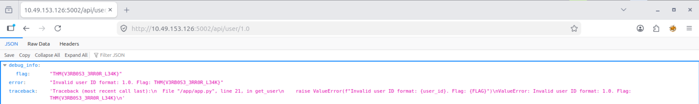

# Security Misconfiguration Assessment – Debug Information Disclosure in User Management API

## Overview

This project documents a hands-on security assessment conducted as part of the TryHackMe OWASP Top 10 (2025) learning path, specifically within **AS02: Security Misconfigurations** under the **Application Design Flaws** category.

The objective of this exercise was to identify insecure application configurations that expose sensitive information through improperly configured error handling and debugging mechanisms.

During testing, the API disclosed internal application details, stack traces, and sensitive debugging information when invalid user identifiers were supplied.

---

## Learning Objectives

* Understand common security misconfiguration vulnerabilities.
* Identify sensitive information disclosure through debugging features.
* Assess the impact of improper error handling mechanisms.
* Learn secure configuration practices for production environments.
* Practice documenting security findings in a professional format.

---

## Scenario

A web-based User Management API provides an endpoint for retrieving user information by user ID.

The application documentation specifies the following endpoint:

```http
GET /api/user/<user_id>
```

The API is intended to accept only numeric user identifiers.

During testing, various user ID formats were supplied to evaluate how the application handled invalid input.

Unexpectedly, the application exposed internal debugging information, including stack traces and sensitive application data when invalid input was processed.

---

## Methodology

### 1. Reconnaissance

* Reviewed the API documentation.
* Identified available endpoints.
* Observed that user information could be retrieved using numeric identifiers.

Example:

```http
GET /api/user/1
```

---

### 2. Analysis

Tested multiple input variations to determine how the application validated user identifiers.

Examples tested:

```text
1
01
001
1.0
1e0
-1
999
9999
```

Special attention was given to responses generated from invalid inputs.

---

### 3. Validation

An invalid user identifier was submitted:

```http
GET /api/user/1.0
```

Instead of returning a generic error message, the API disclosed:

* Internal exception details
* Application source code references
* Debugging information
* Sensitive application data

This confirmed the presence of insecure error handling and debug information disclosure.

---

### 4. Documentation

* Recorded screenshots and API responses.
* Assessed the potential security impact.
* Documented mitigation recommendations.

---

## Findings

### Finding 1: Debug Information Disclosure Through Improper Error Handling

**Category:** OWASP Top 10 (2025) – AS02: Security Misconfigurations

The application exposed excessive internal information when invalid input was submitted.

Example request:

```http
GET /api/user/1.0
```

Instead of returning a generic error response such as:

```json
{
  "error": "Invalid user ID"
}
```

The application returned:

* Detailed exception messages
* Internal file paths
* Source code references
* Stack trace information
* Sensitive debugging data

This behavior provides attackers with valuable information regarding the application's internal structure and implementation.

---

## Impact

If exploited in a production environment, this vulnerability could lead to:

* Exposure of internal application architecture.
* Leakage of sensitive implementation details.
* Easier identification of attack vectors.
* Increased likelihood of successful exploitation.
* Information disclosure supporting further attacks.
* Reduced effectiveness of defense-in-depth controls.

**Risk Severity:** Medium

---

## Evidence

### Observation 1 – Normal API Response

A valid request successfully returned user information.

Request:

```http
GET /api/user/1
```

Response:

```json
{
  "id": "1",
  "name": "John Doe",
  "email": "john@example.com"
}
```

Screenshot:

screenshots/valid-user-request.png

---

### Observation 2 – Invalid User Identifier

A malformed identifier generated an unexpected debug response.

Request:

```http
GET /api/user/1.0
```

Screenshot:



---

### Observation 3 – Internal Application Details Exposed

The response contained:

* Exception information
* Debug metadata
* Source code references
* Internal application logic indicators

Example:

```text
ValueError: Invalid user ID format
```

This information should never be exposed to external users.

---

### Security Observation

The application appears to be running with debugging or verbose error reporting enabled.

Error messages reveal implementation details that could assist attackers during reconnaissance and exploitation phases.

---

## Remediation

### 1. Disable Debug Mode in Production

Ensure debugging features are disabled in production environments.

Example:

```python
DEBUG = False
```

---

### 2. Implement Generic Error Handling

Return standardized error responses without exposing internal details.

Recommended response:

```json
{
  "error": "Invalid request"
}
```

---

### 3. Log Errors Internally

Store detailed exception information in secure server-side logs rather than exposing it to end users.

---

### 4. Implement Input Validation

Validate user-supplied identifiers before processing requests.

Example:

```python
if not user_id.isdigit():
    return error_response
```

---

### 5. Conduct Secure Configuration Reviews

Regularly assess application configurations to ensure:

* Debug mode is disabled
* Sensitive information is protected
* Error handling is secure
* Security baselines are enforced

---

## Skills Demonstrated

* Security Misconfiguration Assessment
* API Security Testing
* Error Handling Analysis
* Information Disclosure Detection
* Vulnerability Analysis
* Risk Assessment
* Security Documentation
* Security Reporting
* OWASP Top 10 Mapping

---

## Tools Used

* Web Browser
* Browser Developer Tools
* API Endpoint Testing
* JSON Viewer
* TryHackMe Lab Environment

---

## Key Takeaways

* Detailed error messages can provide attackers with valuable reconnaissance information.
* Debugging features should never be enabled in production environments.
* Internal exceptions and stack traces must be logged securely rather than exposed to users.
* Proper input validation reduces the risk of unexpected application behavior.
* Security misconfigurations remain one of the most common causes of information disclosure vulnerabilities.

---

## OWASP Mapping

| Category                | Classification                   |
| ----------------------- | -------------------------------- |
| OWASP Top 10 (2025)     | AS02: Security Misconfigurations |
| Vulnerability Type      | Debug Information Disclosure     |
| Risk Level              | Medium                           |
| Impact                  | Information Disclosure           |
| Attack Complexity       | Low                              |
| Authentication Required | No                               |

---

## Disclaimer

This project was completed in a controlled educational environment provided by TryHackMe for cybersecurity learning purposes. No real systems or sensitive data were accessed during this exercise.
