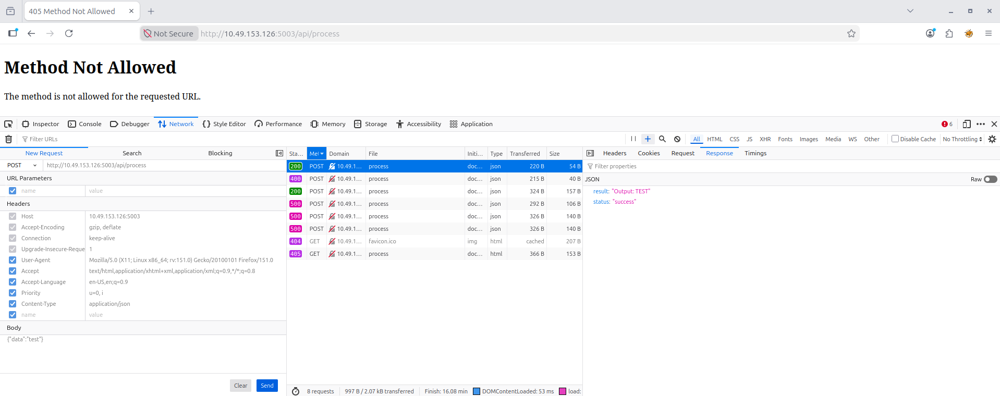
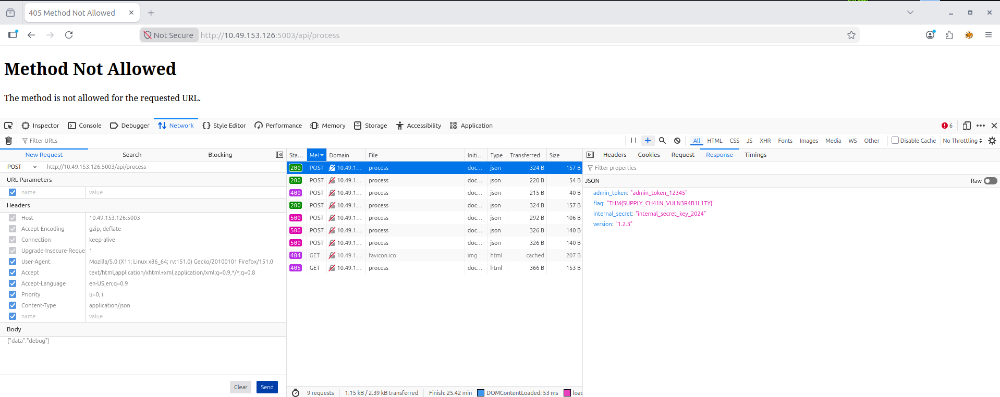

# Software Supply Chain Security Assessment – Vulnerable Third-Party Dependency Exposure

## Overview

This project documents a hands-on security assessment conducted as part of the TryHackMe OWASP Top 10 (2025) learning path, specifically within **AS03: Software Supply Chain Failures** under the **Application Design Flaws** category.

The objective of this exercise was to identify risks associated with insecure third-party dependencies and exposed debugging functionality that could disclose sensitive application information.

During testing, a backend API was found to rely on an unverified third-party library that exposed internal application details through a hidden debug functionality.

---

## Learning Objectives

* Understand Software Supply Chain security risks.
* Identify vulnerabilities introduced by third-party dependencies.
* Analyze the impact of exposed debugging functionality.
* Learn secure dependency management practices.
* Practice documenting software supply chain security findings.

---

## Scenario

A Data Processing Service provides a REST API for processing user-supplied input.

The application documentation exposed the following endpoint:

```http
POST /api/process
```

The endpoint accepts JSON data and returns processed output.

During testing, a special input value triggered a debugging function that disclosed sensitive internal application information.

This behavior suggested that the application depended on an insecure or improperly configured third-party component.

---

## Methodology

### 1. Reconnaissance

* Reviewed available API documentation.
* Identified exposed endpoints.
* Examined request and response behavior.

Available endpoints:

```http
POST /api/process
GET  /api/health
```

---

### 2. Analysis

Normal requests were submitted to observe expected behavior.

Example:

```json
{
  "data": "test"
}
```

Response:

```json
{
  "result": "Output: TEST",
  "status": "success"
}
```

The application appeared to process user input correctly.

---

### 3. Validation

Additional testing was performed to identify undocumented functionality.

Request:

```json
{
  "data": "debug"
}
```

Unexpectedly, the application returned internal debugging information including:

* Administrative token
* Internal application secrets
* Library version information
* Development metadata

This confirmed the presence of insecure functionality originating from an imported third-party dependency.

---

### 4. Documentation

* Recorded request and response data.
* Reviewed source code behavior.
* Assessed software supply chain risks.
* Documented remediation recommendations.

---

## Findings

### Finding 1: Exposure of Sensitive Information Through Third-Party Dependency

**Category:** OWASP Top 10 (2025) – AS03: Software Supply Chain Failures

The application imported functionality from a local third-party library:

```python
from vulnerable_utils import process_data, format_output, debug_info
```

A hidden debug feature exposed sensitive internal information when specific user input was supplied.

Example request:

```json
{
  "data": "debug"
}
```

The application returned debugging information that should never be accessible to external users.

This indicates inadequate review, validation, and security testing of third-party components before deployment.

---

## Impact

If exploited in a production environment, this vulnerability could result in:

* Exposure of administrative credentials.
* Leakage of internal application secrets.
* Disclosure of software version information.
* Increased attack surface for targeted exploitation.
* Unauthorized access to privileged functionality.
* Supply chain compromise risk.
* Regulatory and compliance concerns.

**Risk Severity:** High

---

## Evidence

### Observation 1 – Normal Application Behavior

Request:

```json
{
  "data": "test"
}
```

Response:

```json
{
  "result": "Output: TEST",
  "status": "success"
}
```

Screenshot:



---

### Observation 2 – Debug Functionality Triggered

Request:

```json
{
  "data": "debug"
}
```

The application returned internal debugging information.

Screenshot:



---

### Observation 3 – Source Code Review

Application source code revealed the import of a third-party utility library:

```python
from vulnerable_utils import process_data, format_output, debug_info
```

The endpoint explicitly exposed debugging functionality:

```python
if data == 'debug':
    return jsonify(debug_info())
```

This allowed external users to access sensitive application metadata.

---

### Security Observation

The application trusted a dependency that contained insecure debugging functionality and exposed sensitive information directly to API consumers.

The issue originated from both:

* Insecure dependency usage.
* Unsafe deployment configuration.

---

## Remediation

### 1. Remove Debug Functionality from Production

Disable all debugging endpoints and development features before deployment.

Example:

```python
# Remove debug endpoints
if data == 'debug':
    return error_response
```

---

### 2. Validate Third-Party Dependencies

Perform security reviews before integrating external libraries.

Recommended actions:

* Dependency review
* Security testing
* Code review
* Vulnerability assessment

---

### 3. Implement Dependency Management

Use:

* Dependency pinning
* Version control
* Approved package repositories
* Security monitoring tools

---

### 4. Maintain a Software Bill of Materials (SBOM)

Track all third-party components used within the application.

Benefits:

* Improved visibility
* Faster vulnerability response
* Better compliance management

---

### 5. Implement Secret Management

Never expose:

* API keys
* Administrative tokens
* Internal secrets

Use secure secret management solutions such as:

* Environment variables
* Vault solutions
* Cloud secret managers

---

### 6. Perform Regular Dependency Scanning

Utilize automated tools to identify vulnerable dependencies.

Examples:

* Dependabot
* Snyk
* Trivy
* OWASP Dependency-Check

---

## Skills Demonstrated

* Software Supply Chain Analysis
* Dependency Security Assessment
* API Security Testing
* Source Code Review
* Information Disclosure Analysis
* Vulnerability Validation
* Risk Assessment
* Security Documentation
* Security Reporting
* OWASP Top 10 Mapping

---

## Tools Used

* Web Browser
* Browser Developer Tools
* API Endpoint Testing
* Source Code Review
* JSON Response Analysis
* TryHackMe Lab Environment

---

## Key Takeaways

* Third-party dependencies can introduce significant security risks if not properly reviewed.
* Hidden debugging functionality should never be accessible in production environments.
* Software supply chain security extends beyond application code and includes all external components.
* Sensitive information exposure often originates from development artifacts left in production systems.
* Organizations should maintain visibility into all software dependencies and continuously monitor them for vulnerabilities.

---

## OWASP Mapping

| Category                | Classification                       |
| ----------------------- | ------------------------------------ |
| OWASP Top 10 (2025)     | AS03: Software Supply Chain Failures |
| Vulnerability Type      | Insecure Third-Party Dependency      |
| Risk Level              | High                                 |
| Impact                  | Information Disclosure               |
| Attack Complexity       | Low                                  |
| Authentication Required | No                                   |

---

## Disclaimer

This project was completed in a controlled educational environment provided by TryHackMe for cybersecurity learning purposes. No real systems or sensitive data were accessed during this exercise.
