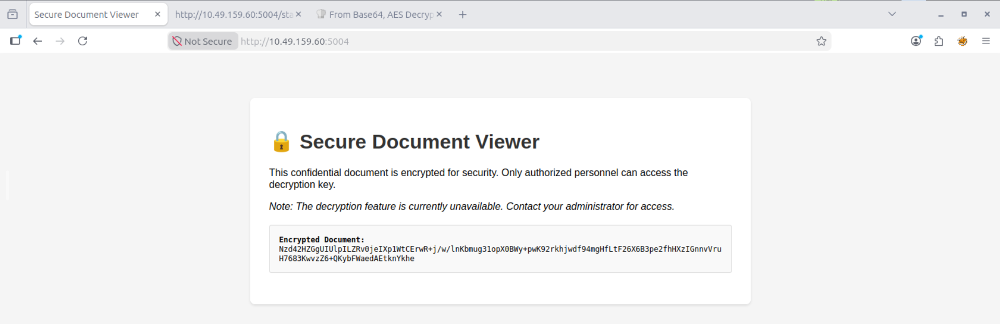
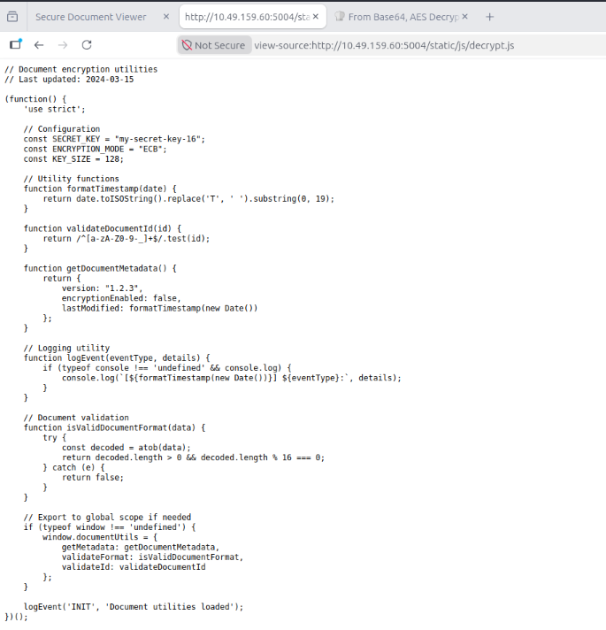
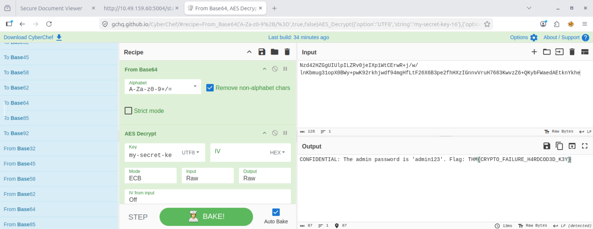

# Cryptographic Failures Assessment – Hardcoded Encryption Key and Weak Cryptographic Implementation

## Overview

This project documents a hands-on security assessment conducted as part of the TryHackMe OWASP Top 10 (2025) learning path, specifically within **AS04: Cryptographic Failures** under the **Application Design Flaws** category.

The objective of this exercise was to identify weaknesses in the application's cryptographic implementation, analyze exposed encryption mechanisms, and evaluate the risks associated with insecure key management practices.

During testing, sensitive encrypted data was discovered alongside exposed client-side cryptographic configurations, allowing the encrypted content to be successfully decrypted.

---

## Learning Objectives

* Understand common cryptographic implementation failures.
* Identify insecure key management practices.
* Analyze risks associated with client-side cryptographic exposure.
* Assess the impact of hardcoded encryption keys.
* Practice documenting cryptographic security findings.

---

## Scenario

A web application called **Secure Document Viewer** was designed to store confidential information in encrypted form.

The application displayed an encrypted document and stated that decryption functionality was unavailable to end users.

However, further inspection of the application source code revealed cryptographic implementation details exposed within a JavaScript file.

The application relied on client-side encryption settings, including the encryption algorithm, encryption mode, and encryption key.

---

## Methodology

### 1. Reconnaissance

* Examined the application's user interface.
* Identified an encrypted document presented to users.
* Reviewed the page source code and linked JavaScript files.

Observed encrypted content:

```text id="cmj7ux"
Encrypted Document:
<Base64 Encoded Ciphertext>
```

---

### 2. Analysis

Source code review revealed cryptographic configuration details embedded within a client-side JavaScript file.

Exposed configuration:

```javascript id="85cb4r"
const SECRET_KEY = "my-secret-key-16";
const ENCRYPTION_MODE = "ECB";
const KEY_SIZE = 128;
```

The application exposed:

* Encryption key
* Encryption mode
* Key length
* Utility functions

This information should not be accessible to end users.

---

### 3. Validation

The encrypted document was extracted and analyzed.

The following process was performed:

1. Decode Base64 encoded ciphertext.
2. Apply AES decryption.
3. Use the exposed key discovered in the source code.
4. Configure AES mode according to application settings.

Decryption successfully revealed sensitive document contents.

This confirmed that the application's cryptographic controls could be bypassed through exposed implementation details.

---

### 4. Documentation

* Captured screenshots.
* Recorded cryptographic configuration details.
* Validated decryption process.
* Assessed business impact.
* Documented remediation recommendations.

---

## Findings

### Finding 1: Hardcoded Cryptographic Key Exposure

**Category:** OWASP Top 10 (2025) – AS04: Cryptographic Failures

The application exposed a hardcoded encryption key within publicly accessible client-side code.

Example:

```javascript id="gxz35o"
const SECRET_KEY = "my-secret-key-16";
```

Because the encryption key was available to all users, anyone with access to the application source code could decrypt protected content.

This defeats the primary purpose of encryption.

---

### Finding 2: Insecure Encryption Mode (AES-ECB)

The application utilized AES encryption in ECB mode.

Example:

```javascript id="gkh8nx"
const ENCRYPTION_MODE = "ECB";
```

ECB mode is considered insecure because identical plaintext blocks produce identical ciphertext blocks, potentially revealing patterns within encrypted data.

Modern applications should avoid ECB mode.

---

### Finding 3: Client-Side Cryptographic Implementation Disclosure

The application exposed the complete cryptographic configuration through publicly accessible JavaScript resources.

Disclosed information included:

* Encryption key
* Encryption mode
* Key size
* Validation functions

This enabled attackers to reconstruct the decryption process.

---

## Impact

If exploited in a production environment, this vulnerability could lead to:

* Unauthorized access to confidential documents.
* Exposure of sensitive business information.
* Disclosure of credentials or secrets.
* Regulatory compliance violations.
* Loss of confidentiality.
* Increased risk of data breaches.

**Risk Severity:** High

---

## Evidence

### Observation 1 – Encrypted Document Exposure

The application displayed an encrypted document to users.

Screenshot:



---

### Observation 2 – Source Code Disclosure

Reviewing the linked JavaScript file revealed cryptographic implementation details.

Screenshot:



Exposed configuration:

```javascript id="a5brta"
const SECRET_KEY = "my-secret-key-16";
const ENCRYPTION_MODE = "ECB";
```

---

### Observation 3 – Successful Decryption

The encrypted document was successfully decrypted using the exposed key and configuration.

Screenshot:



Recovered content included:

```text id="5prigq"
CONFIDENTIAL:
Administrative credentials and internal information were successfully recovered from the encrypted document.
```

Sensitive values have been intentionally redacted for responsible disclosure.

---

### Security Observation

The application relied on secrecy of implementation rather than secure cryptographic design.

Once the client-side code was reviewed, all information necessary to decrypt the protected document became available.

---

## Remediation

### 1. Remove Encryption Keys from Client-Side Code

Encryption keys must never be stored within:

* JavaScript files
* Mobile applications
* Client-side resources

Keys should remain on trusted server-side systems.

---

### 2. Implement Secure Key Management

Use secure key storage solutions such as:

* Hardware Security Modules (HSM)
* Cloud Key Management Services (KMS)
* Secret Vaults

Examples:

```text id="t0t2ka"
AWS KMS
Azure Key Vault
HashiCorp Vault
Google Cloud KMS
```

---

### 3. Replace ECB Mode

Avoid:

```text id="qj09wz"
AES-ECB
```

Use:

```text id="z4r5nc"
AES-GCM
AES-CBC (with secure IV handling)
ChaCha20-Poly1305
```

---

### 4. Perform Server-Side Cryptographic Operations

Encryption and decryption should occur on trusted backend systems rather than within client-side code.

---

### 5. Conduct Secure Code Reviews

Regularly review application code for:

* Hardcoded secrets
* Cryptographic misuse
* Key exposure
* Weak algorithms

---

### 6. Implement Secret Scanning

Use automated tools to detect embedded secrets before deployment.

Examples:

```text id="c33knr"
GitLeaks
TruffleHog
GitGuardian
```

---

## Skills Demonstrated

* Cryptographic Security Assessment
* Source Code Review
* Encryption Analysis
* Secure Key Management Evaluation
* Information Disclosure Analysis
* Vulnerability Validation
* Risk Assessment
* Security Documentation
* Security Reporting
* OWASP Top 10 Mapping

---

## Tools Used

* Web Browser
* Browser Developer Tools
* Source Code Inspection
* CyberChef
* AES Decryption Analysis
* Base64 Decoding
* TryHackMe Lab Environment

---

## Key Takeaways

* Encryption is ineffective when encryption keys are exposed.
* Hardcoded secrets are among the most common cryptographic implementation mistakes.
* Client-side cryptographic logic should never contain sensitive key material.
* AES-ECB is an outdated encryption mode that should be avoided in modern applications.
* Secure key management is just as important as strong encryption algorithms.
* Cryptographic Failures often originate from implementation mistakes rather than weaknesses in the encryption algorithm itself.

---

## OWASP Mapping

| Category                | Classification                      |
| ----------------------- | ----------------------------------- |
| OWASP Top 10 (2025)     | AS04: Cryptographic Failures        |
| Vulnerability Type      | Hardcoded Encryption Key Exposure   |
| Risk Level              | High                                |
| Impact                  | Confidential Information Disclosure |
| Attack Complexity       | Low                                 |
| Authentication Required | No                                  |

---

## Disclaimer

This project was completed in a controlled educational environment provided by TryHackMe for cybersecurity learning purposes. No real systems or sensitive data were accessed during this exercise.
