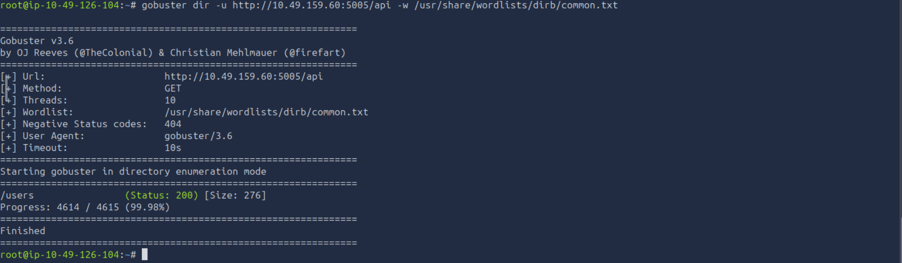
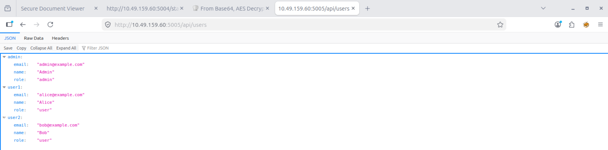
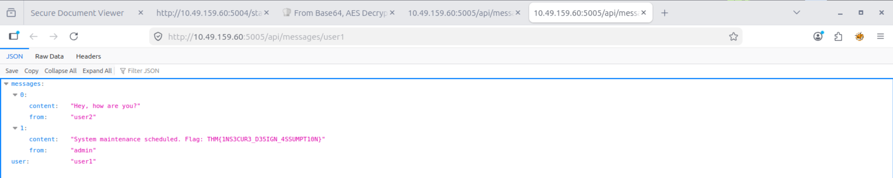
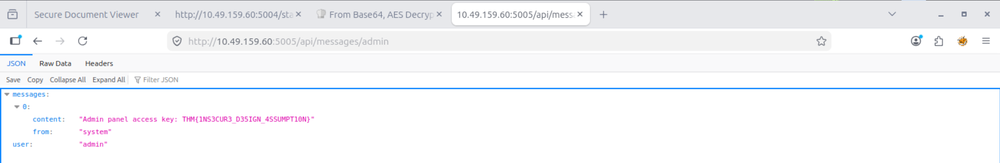
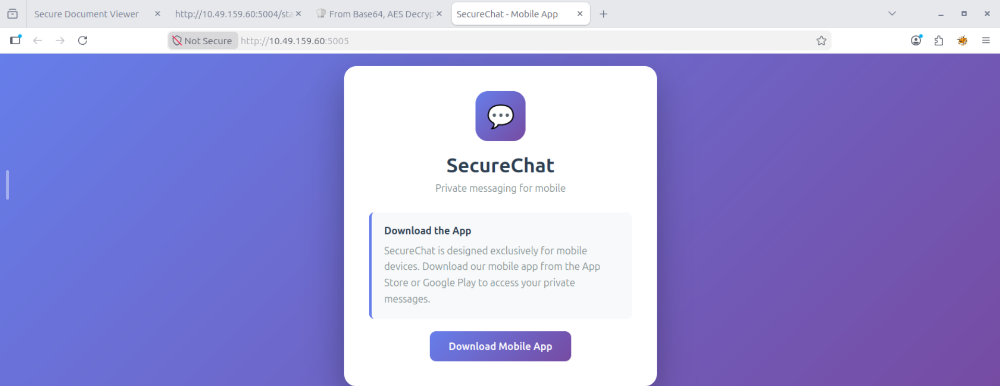

# Insecure Design Assessment – Assumption-Based Access Control Bypass in SecureChat API

## Overview

This project documents a hands-on security assessment conducted as part of the TryHackMe OWASP Top 10 (2025) learning path, specifically within **AS06: Insecure Design** under the **Application Design Flaws** category.

The objective of this exercise was to identify weaknesses in application design assumptions that allowed unauthorized access to sensitive information through exposed API endpoints.

During testing, a messaging platform relied on the assumption that users would only access the application through its mobile interface. However, backend API endpoints remained publicly accessible and lacked sufficient authorization controls, allowing direct access to user and administrator data.

---

## Learning Objectives

* Understand the concept of Insecure Design vulnerabilities.
* Identify flawed security assumptions within application architecture.
* Analyze exposed backend functionality and API abuse scenarios.
* Assess the impact of missing authorization controls.
* Practice documenting security findings in a professional format.

---

## Scenario

A messaging application called **SecureChat** was presented as a mobile-only platform.

The web application displayed a message indicating that users must download the mobile application to access private messages.

However, during assessment, publicly accessible API endpoints were discovered that exposed user information and private messages directly through the browser.

The application's security model relied on the assumption that users would only interact with the intended mobile application rather than enforcing authorization at the API layer.

---

## Methodology

### 1. Reconnaissance

* Reviewed the publicly accessible web application.
* Identified references to a messaging platform.
* Investigated hidden API endpoints through endpoint enumeration.

Initial enumeration:

```bash
gobuster dir \
-u http://TARGET/api \
-w /usr/share/wordlists/dirb/common.txt
```

Discovered endpoint:

```text
/api/users
```

### 2. Analysis

The exposed endpoint revealed internal user information.

Request:

```http
GET /api/users
```

Response:

```json
{
  "admin": {
    "role": "admin"
  },
  "user1": {
    "role": "user"
  },
  "user2": {
    "role": "user"
  }
}
```

This information was used to identify additional API paths.

### 3. Validation

Further testing revealed message endpoints:

```http
GET /api/messages/user1
GET /api/messages/user2
GET /api/messages/admin
```

The application returned private messages without requiring authentication or authorization.

Access to the administrative message endpoint disclosed sensitive internal information intended only for privileged users.

### 4. Documentation

* Recorded exposed endpoints.
* Captured API responses.
* Assessed the business impact.
* Documented remediation recommendations.

---

## Findings

### Finding 1: Missing Authorization Controls on Sensitive API Endpoints

**Category:** OWASP Top 10 (2025) – AS06: Insecure Design

The application's security model relied on a design assumption that users would only access resources through the official mobile application.

However, backend APIs remained directly accessible and lacked proper authorization validation.

Exposed endpoints included:

```http
GET /api/users
GET /api/messages/user1
GET /api/messages/user2
GET /api/messages/admin
```

Because authorization checks were absent, any user could retrieve information belonging to other users, including privileged accounts.

---

### Finding 2: Exposure of Administrative Resources

The administrative messaging endpoint was directly accessible:

```http
GET /api/messages/admin
```

The response contained internal administrative information that should only be accessible to authorized personnel.

Example (redacted):

```json
{
  "messages": [
    {
      "content": "Admin panel access key: [REDACTED]",
      "from": "system"
    }
  ],
  "user": "admin"
}
```

This demonstrates a failure in security design rather than a simple coding error.

---

### Finding 3: Security by Obscurity

The application attempted to protect functionality by hiding it behind a mobile application interface.

Example:

```text
"Download the mobile application to access messages."
```

However, the backend API remained publicly accessible.

This represents a classic example of:

```text
Security by Obscurity
```

where security depends on users not discovering hidden functionality rather than enforcing actual access controls.

---

## Impact

If exploited in a production environment, this vulnerability could lead to:

* Unauthorized access to private communications.
* Disclosure of user information.
* Exposure of administrative resources.
* Information leakage supporting further attacks.
* Privacy violations.
* Regulatory compliance issues.
* Reputational damage.

**Risk Severity:** High

---

## Evidence

### Observation 1 – Endpoint Enumeration

Gobuster identified an undocumented API endpoint.

Command:

```bash
gobuster dir \
-u http://TARGET/api \
-w /usr/share/wordlists/dirb/common.txt
```

Result:

```text
/api/users
```

Screenshot:



---

### Observation 2 – User Enumeration

Request:

```http
GET /api/users
```

The response disclosed user account information and role assignments.

Screenshot:



---

### Observation 3 – Access to User Messages

Request:

```http
GET /api/messages/user1
```

Response returned private user communications.

Screenshot:



---

### Observation 4 – Access to Administrative Messages

Request:

```http
GET /api/messages/admin
```

The application returned privileged administrative content.

Sensitive values have been redacted for responsible disclosure.

Screenshot:



---

### Observation 5 – Design Assumption Failure

The application claimed that messages were only accessible through the mobile application.

However:

```text
Web Interface → Restricted
API Endpoint → Publicly Accessible
```

This demonstrates a flawed security design assumption.

Screenshot:



---

## Remediation

### 1. Implement Server-Side Authorization

Every request must be validated on the server side before returning sensitive data.

Example:

```text
User A → Access User A Messages
User B → Access User B Messages
Admin  → Access Administrative Messages
```

### 2. Require Authentication

Protect all messaging endpoints using authenticated sessions or secure tokens.

Examples:

* JWT
* OAuth 2.0
* Session-Based Authentication

### 3. Apply Role-Based Access Control (RBAC)

Restrict administrative resources to authorized users only.

Example:

```text
Role: User
→ Own messages only

Role: Admin
→ Administrative resources
```

### 4. Remove Security by Obscurity

Do not rely on hidden URLs, undocumented APIs, or mobile-only assumptions as security controls.

### 5. Conduct Secure Design Reviews

Perform threat modeling during development to identify:

* Trust boundary issues
* Authorization weaknesses
* Sensitive data exposure risks
* Business logic flaws

---

## Skills Demonstrated

* API Security Assessment
* Endpoint Enumeration
* Authorization Testing
* Business Logic Analysis
* Insecure Design Identification
* Information Disclosure Analysis
* Risk Assessment
* Security Documentation
* Security Reporting
* OWASP Top 10 Mapping

---

## Tools Used

* Gobuster
* Browser Developer Tools
* API Endpoint Testing
* JSON Viewer
* TryHackMe Lab Environment

---

## Key Takeaways

* Security assumptions are not security controls.
* APIs must enforce authorization regardless of how clients access them.
* Mobile applications should never be trusted as a security boundary.
* Hidden functionality remains vulnerable if backend access controls are missing.
* Insecure Design vulnerabilities often originate during architecture and planning stages rather than implementation.
* Threat modeling is essential for identifying flawed security assumptions before deployment.

---

## OWASP Mapping

| Category                | Classification                               |
| ----------------------- | -------------------------------------------- |
| OWASP Top 10 (2025)     | AS06: Insecure Design                        |
| Vulnerability Type      | Missing Authorization by Design              |
| Risk Level              | High                                         |
| Impact                  | Unauthorized Access to Sensitive Information |
| Attack Complexity       | Low                                          |
| Authentication Required | No                                           |

---

## Disclaimer

This project was completed in a controlled educational environment provided by TryHackMe for cybersecurity learning purposes. No real systems or sensitive data were accessed during this exercise.
